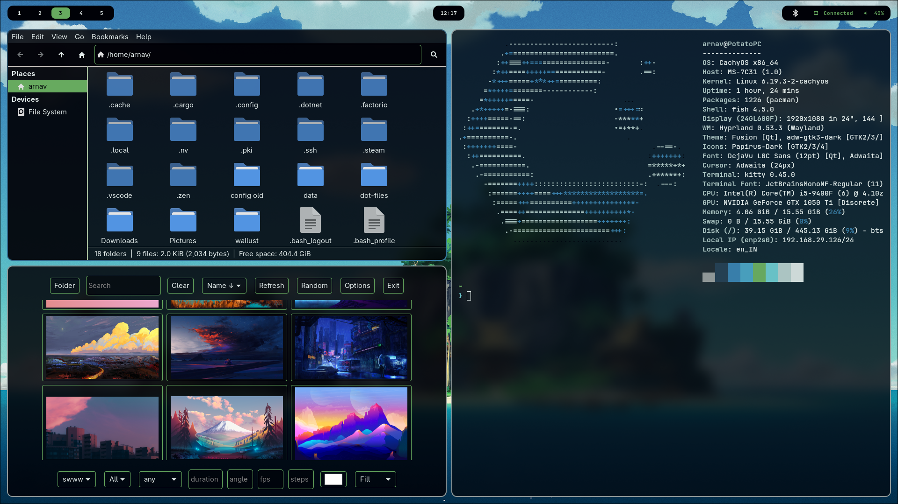
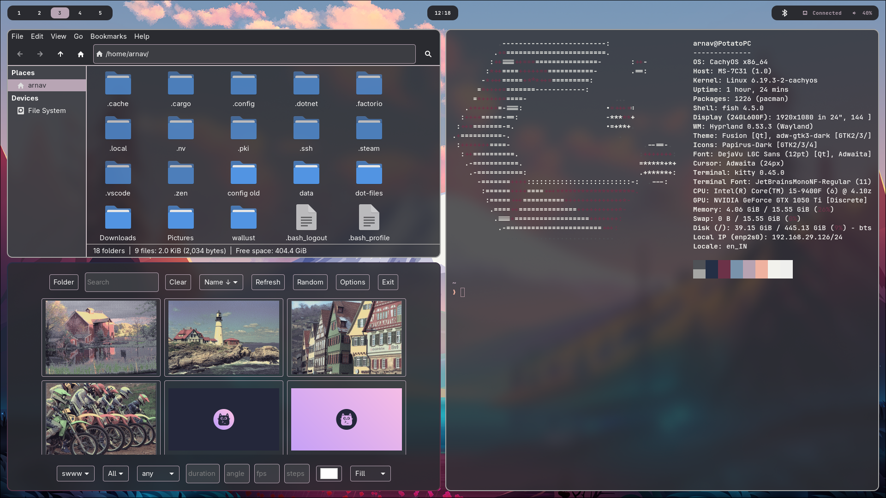

# Dotfiles

Personal dotfiles for a Hyprland/Wayland desktop environment.

## Screenshots





## ✨ Dynamic Colors with Wallust

The main feature of this setup is **fully dynamic theming** powered by [Wallust](https://codeberg.org/explosion-mental/wallust). Every time a new wallpaper is set, Wallust extracts a color palette from the image and applies it across the entire desktop — no manual tweaking required.

**Themed components:**  Kitty · Waybar · Rofi · Mako · Wlogout · Hyprland · Hyprlock · VS Code · Qt6ct


## Included Configurations

| Directory | Application | Description |
|-----------|-------------|-------------|
| `fish` | [Fish](https://fishshell.com/) | Shell configuration |
| `hypr` | [Hyprland](https://hyprland.org/) | Window manager, lock screen (hyprlock), and idle daemon (hypridle) |
| `kitty` | [Kitty](https://sw.kovidgoyal.net/kitty/) | Terminal emulator |
| `waybar` | [Waybar](https://github.com/Alexays/Waybar) | Status bar |
| `rofi` | [Rofi](https://github.com/lbonn/rofi) | Application launcher |
| `mako` | [Mako](https://github.com/emersion/mako) | Notification daemon |
| `gtk` | GTK 3 | Theme overrides |
| `wallust` | [Wallust](https://codeberg.org/explosion-mental/wallust) | Wallpaper-based color scheme generator with templates |
| `waypaper` | [Waypaper](https://github.com/anufrievroman/waypaper) | Wallpaper manager |
| `wlogout` | [Wlogout](https://github.com/ArtsyMacaw/wlogout) | Logout menu |

## Installation

The dotfiles are managed with [GNU Stow](https://www.gnu.org/software/stow/), which symlinks each package into your home directory.

```bash
# Clone the repo
git clone https://github.com/<your-username>/dot-files.git ~/dot-files
cd ~/dot-files

# Install all packages at once
stow fish gtk hypr kitty mako rofi scripts wallust waybar waypaper wlogout

# Or install individual packages
stow hypr
stow kitty waybar
```

To uninstall a package, use the `-D` flag:

```bash
stow -D hypr
```
